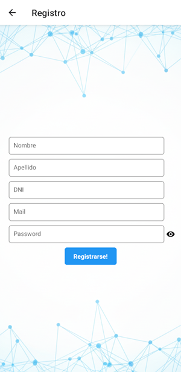

# Tecnicatura Universitaria en Desarrollo Web - 2025 - 2do cuatrimestre

## Trabajo Práctico de la materia "Desarrollo para Móviles"

### ACTIVIDAD N° 2 - Diseño de Interfaz de Aplicación

#### Grupo '9'

#### Integrantes:

- Luis Sanchez
- José Battaglia
- Cristian Seltenreich

### LOGIN

Pantalla de Login para autenticación.

### Registro

Registro de usuario nuevo.

### Home

Visualización del mapa y opción para realizar fichada de ingreso o egreso.

### Fichada

Registro de la foto del usuario con sus coordenadas del GPS.

### Dashboard

Dashboard para visualización de estadisticas.

### Ingresos y Egresos

Listado de Ingresos y Egresos.

### Perfil

Perfil de usuario y personalización.

### Detalles del Usuario

Pantalla para ajustar datos personales del usuario
